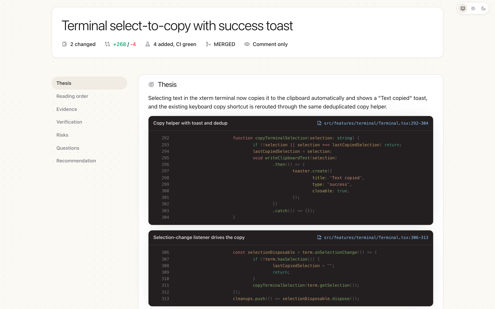

<div align="center">

# Guided Review

**Turn any pull request into a readable map — every claim backed by real code.**

[](https://github.com/AkaraChen/guided-review/actions/workflows/ci.yml)
[](LICENSE)
[](https://www.rust-lang.org)
[](skill/SKILL.md)

English &nbsp;·&nbsp; [中文](./README.CN.md)



</div>

---

## Why Guided Review?

You open a 60-file pull request. The description says one thing, the diff says
forty. You scroll file by file, lose the thread, and end up approving on vibes
— or blocking on a nit while the real risk ships.

Review tools got better at *showing* diffs. They never got better at
*explaining* them. And now that AI writes more of the code, the bottleneck is
no longer writing changes — it is understanding them.

**Guided Review is built on a simple idea: a review artifact should reduce
comprehension cost, not add ceremony.**

## How It Works

```text
your agent reads the diff  ──▶  writes a review payload  ──▶  egr renders one page
        (any coding agent)        (JSON, schema-checked)        (self-contained HTML)
```

1. **The skill drives the review.** Your coding agent inspects the diff,
   reconstructs the change, and writes a JSON payload following the schema
   printed by `egr generate -h`.
2. **The renderer enforces honesty.** Claims without code excerpts, excerpts
   with the wrong line count, and approvals that contradict their own
   blockers are rejected before any HTML is written.
3. **You read one page.** Thesis, reading order, line map, risks,
   verification status, and a recommendation — every statement linked to
   syntax-highlighted lines from the real diff.

## Install

```console
# the egr CLI
cargo install --git https://github.com/AkaraChen/guided-review guided-review

# the agent skill (drives egr from your coding agent)
npx skills add akarachen/guided-review
```

## Quick Start

```console
egr generate -h                   # prints the review JSON Schema
egr generate owner/repo#123 --review review.json --output out/index.html
egr serve out                     # serves on 127.0.0.1, prints the URL
```

See [`examples/review.json`](examples/review.json) for a complete payload and
[`skill/SKILL.md`](skill/SKILL.md) for the agent workflow.

## The Philosophy

### Evidence or it didn't happen

Every statement in a Guided Review — the thesis, each risk, each answer —
must cite real lines from the diff. A review you can't verify is a review you
can't trust.

### A map, not a summary

A file-by-file summary tells you what you could already see. A Guided Review
reconstructs the change as a system: a one-sentence thesis, a suggested
reading order, the visible and hidden lines of the change, and the risks that
deserve human attention.

### Judgment stays human

AI drafts the map; humans own the merge decision. Every claim is labeled as
*observed* or *synthesis*, so a reviewer always knows which statements were
read directly from the code and which were concluded from it.

## What You Can Do

**Read one page instead of sixty files**

- A self-contained HTML page per pull request — no server, no account, no
  build step to view it.
- Suggested reading order tells you where to start and why.
- Every claim links to syntax-highlighted excerpts with exact file and line
  references.

**Judge risk, not diff order**

- Risks classified as blocker, should-fix, or follow-up.
- Verification status per claim: verified, partial, or unproven.
- A final recommendation with blockers kept separate from polish.

**Let your agent do the legwork**

- A JSON contract, printed as a schema from `egr generate -h`, that any
  coding agent can fill.
- A ready-made agent skill in [`skill/`](skill/SKILL.md) that drives the whole
  workflow: inspect the diff, write the payload, render, and serve.
- `egr serve` previews the result locally and shuts itself down when you
  close the tab.

## Who It's For

Guided Review is for engineers who:

- review large or AI-generated pull requests and want the story, not the noise;
- run coding agents and want review artifacts they can actually audit;
- believe an approval should mean "I understood this", not "I scrolled this".

## The Vision

Code review is becoming the narrowest part of the software pipeline. We think
the fix is not faster skimming — it is artifacts that make understanding
cheap and verification mandatory. Guided Review wants to be the format a
reviewer reaches for the way they reach for a diff today.

---

<div align="center">

Made by [@AkaraChen](https://github.com/AkaraChen) · Reviews are read by humans, proven by code.

</div>
